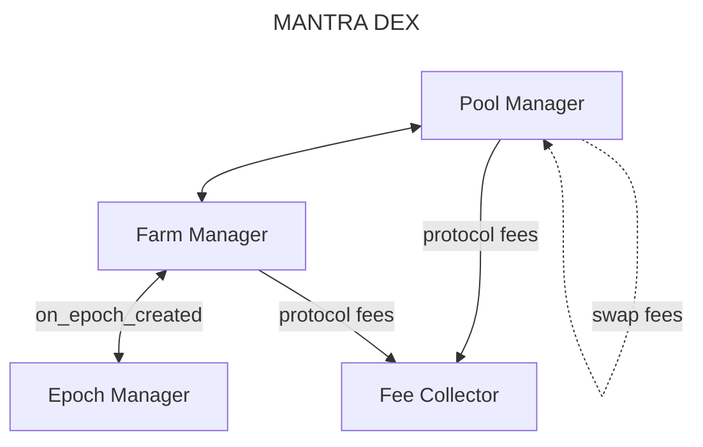

# MANTRA DEX

## Getting started

To get started with MANTRA DEX, please go through the [contributing guide](./docs/CONTRIBUTING.md) to see the
different ways to contribute to the project.

## Resources

1. [Website](https://mantra.zone/)
2. [Docs]()

## Architecture

MANTRA DEX is based on White Whale V2. The protocol is built around singleton contracts, which makes it easier to manage
and integrate with other protocols.

The following is the architecture of MANTRA DEX, and a general description of each contract:

The direction of the arrows represents the dependencies between the contracts.

### Pool Manager

The Pool Manager is the contract that manages the pools in the DEX. It is responsible for creating pool and handling
swaps. Pool creation is permisionless, meaning anyone can create a pool if the fee is paid. The Pool Manager depends on
the Farm Manager and the Fee Collector.

### Farm Manager

The Farm Manager is the contract that manages the farms in the protocol. It is responsible for creating and
distributing rewards on pools. Farm creation is permissionless, meaning anyone can create a farm if the fee is paid.
The Farm Manager depends on the Epoch Manager, as rewards are distributed based on epochs.

### Fee Collector

The Fee Collector collects the fees accrued by the protocol. Whenever a pool or a farm is created, a fee is sent
to the Fee Collector. As of now, the Fee Collector does not have any other function.

### Epoch Manager

The Epoch Manager is the contract that manages the epochs in the protocol. Its single responsibility is to create the epochs,
which are used by the Farm Manager for distributing rewards.

## Instantiation

Based on the dependencies between the contracts, the instantiation of the contracts is as follows:

- Epoch Manager
- Fee Collector
- Farm Manager
- Pool Manager

---

## Building and Deploying MANTRA DEX

To build and deploy MANTRA DEX's smart contracts, there are a series of deployment scripts under `scripts/`. Alternatively,
there are a few `just` recipes you can take advantage of. You need at least Rust v1.65.0 to compile the contracts.

### Build scripts

- `build_release.sh`: builds the project artifacts, optimized for production.
- `build_schemas.sh`: generates schemas for the contracts.
- `check_artifacts_size.sh`: validates the size of the optimized artifacts. The default maximum size is 600 kB, though
  it is customizable by passing the number of kB to the script. For example `check_artifacts_size.sh 400` verifies the
  artifacts are under 400 kB.

### Just recipes

All recipes are found in the `justfile`. To see all available recipes, run `just` or `just --list`. Here are some of them:

- `build` # Builds the whole project.
- `optimize` # Creates the optimized wasm files for deployment.
- `fmt` # Formats the rust, toml and sh files in the project.
- `schemas` # Generates the schemas for the contracts.

## Testing

To run the tests, run `cargo test`. You can also run `cargo tarpaulin -v` to get test code coverage.

## Disclaimer

**Use the contracts and the MANTRA DEX app at your own risk!**

## Audit

The MANTRA DEX contract's audit is currently in progress.

## Contributing

[Contributing Guide](./docs/CONTRIBUTING.md)

[Code of Conduct](./docs/CODE_OF_CONDUCT.md)

[Security Policies and Procedures](./docs/SECURITY.md)

[License](./LICENSE)
