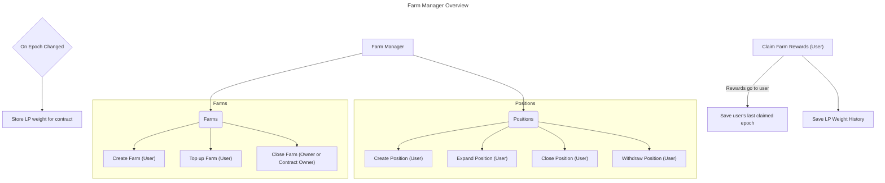

# Farm Manager

The Farm Manager is a monolithic contract that handles all the farms/incentives-related logic for the pools.

## How it works

The Farm Manager has two main concepts; an `Farm`, defined as a reward to be distributed and a `Position`, defined as a
user's liquidity in a pool locked in the contract.

Users of the Liquidity Hub, when providing liquidity, can opt to lock their LP shares which will in turn send them to
the Farm Manager until they are unlocked.

### Farms

Creating farms is permissionless, and farms can be perpetual. This means they can be expanded forever. Anyone
can create a farm by calling the `ManageFarm` message with the `FarmAction::Fill` action and paying the
farm creation fee, which is sent to the Fee Collector.

Users can decide to provide an identifier, which they can later use to top up or close the farm. If no identifier is
provided, the contract will generate one.

#### Topping up a Farm

To top up a farm, the owner of the farm must call `ManageFarm` with the `FarmAction::Fill` action.
The user must provide the same identifier as the original farm. The farm can only be topped up with the same
token as the original farm, and the amount must be a multiple of the original farm's amount.

#### Closing a Farm

To close a farm, the owner of the farm or the owner of the contract must call `ManageFarm` with the
`FarmAction::Close` action with the identifier of the farm to be closed. The farm will be closed, and the
remaining tokens will be sent to the owner of the farm.

#### Reward Distribution

Farm rewards are distributed every epoch, which is created by the Epoch Manager. Whenever an epoch is created; the
Farm Manager gets called via the `EpochChangedHook` hook, alerting the contract that a new epoch has been created.
The contract will then take snapshots for every LP token in the contract and save it in the `LP_WEIGHT_HISTORY` map for
the current epoch. That helps to calculate the rewards when users claim them.

The maximum number of concurrent farms for a given LP denom is defined when the contract is instantiated, and it is
stored in the config as `max_concurrent_farms`.

### Positions

Positions can be created, expanded (topped up), or withdrawn. This is done via the `ManagePosition`
message, followed by the desired action, i.e. `PositionAction::Fill`, `PositionAction::Close` or `PositionAction::Withdraw`.
When a user creates a position, it must provide an unlocking duration. The unlocking duration is the time it takes in
seconds to unlock the position, which is necessary to withdraw the LP tokens from the contract.

#### Topping up a Position

When a user creates a position, the LP tokens are locked in the contract. The user can't withdraw them until the unlocking
duration is complete. To expand a position, the user must call `ManagePosition` with the `PositionAction::Fill` action
using the same position identifier as the original position. In this case, since it's considered to be the same position,
any changes in the unlocking duration parameter passed along with the `PositionAction::Fill` action will be ignored.
Instead, the one in the original position will be used.

If a user doesn't provide an identifier when creating a position, the contract will generate one.

The minimum unlocking duration is 1 day, and the maximum is 365 days.

#### Closing a Position

Closing a position is done by calling `ManagePosition` with the `PositionAction::Close` action. The user must provide the
identifier of the position to be closed. Once this action is triggered, the `Position.open` state is set to false, and
`expiring_at` is set to the block height after which the position will be able to be withdrawn.

#### Withdrawing a Position

Once the unlocking duration is complete, the user can withdraw the LP tokens from the contract by calling the `ManagePosition`
with the `PositionAction::Withdraw` action. Alternatively, if the user doesn't want to wait for the unlocking duration to
complete, it is possible to do an emergency withdrawal by passing `true` on the `emergency_unlock` parameter. This will
unlock and withdraw the position immediately, but the user will pay a penalty fee that will go the Fee Collector.

Once the user closes and withdraws the position, they receive their LP tokens back.

### Claiming Farm Rewards

Users can claim farm rewards from active farms for their LP tokens, only if they have a position in the
contract. Users can only claim rewards for future epochs, i.e. after the epoch in which the position was created.

Farm rewards are distributed based on the user's share of the total LP tokens in the contract. So if there's a total
of 100 LP tokens in the contract, and a user has 10 LP tokens, the user will receive 10% of the rewards for that epoch,
for that given farm.

To claim rewards, the user must call the `Claim` message. Once that's done, the contract will save the epoch in which the
claim was made in `LAST_CLAIMED_EPOCH`, and will sync the user's LP weight history saved in `LP_WEIGHT_HISTORY`. This helps
computing the rewards for the user.

---

