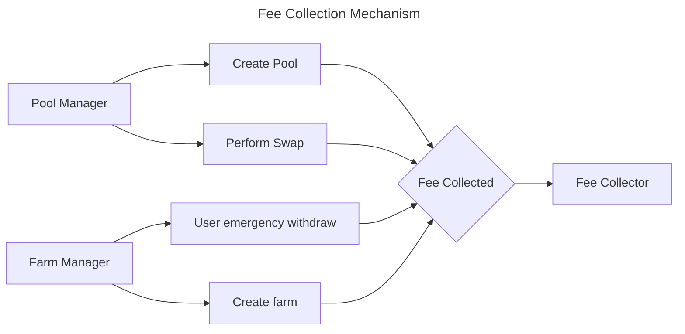

# Fee Collector

The Fee Collector is a contract that collects the fees accrued by the protocol. Whenever a pool or a farm is created,
as well as swaps, a fee is sent to the Fee Collector. As of now, the Fee Collector does not have any other function.

